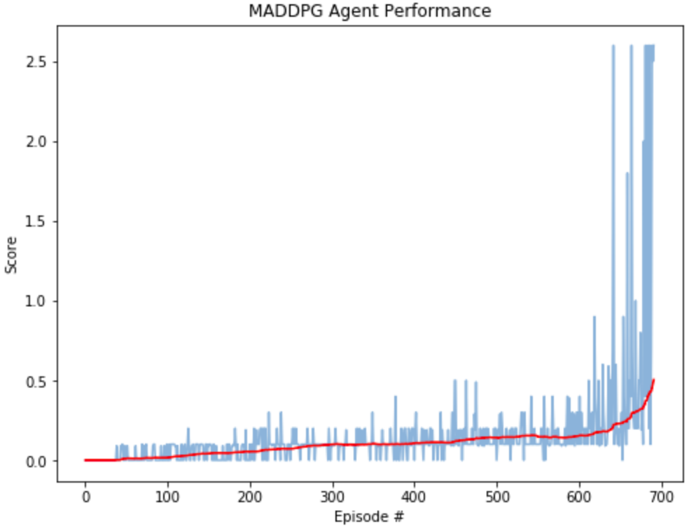

# Udacity Deep Reinforcment Learning Nanodegree 
## Project 3: Collaboration and Competition Challenge
 This is my implementation to sovle Collaboration and Competition Challenge from Unity ML-Agents.

### Introduction

In this environment, two agents control rackets to bounce a ball over a net. If an agent hits the ball over the net, it receives a reward of +0.1. If an agent lets a ball hit the ground or hits the ball out of bounds, it receives a reward of -0.01. Thus, the goal of each agent is to keep the ball in play.

The observation space consists of 8 variables corresponding to the position and velocity of the ball and racket. Each agent receives its own, local observation. Two continuous actions are available, corresponding to movement toward (or away from) the net, and jumping.

The task is episodic, and in order to solve the environment, your agents must get an average score of +0.5 (over 100 consecutive episodes, after taking the maximum over both agents). Specifically,

After each episode, we add up the rewards that each agent received (without discounting), to get a score for each agent. This yields 2 (potentially different) scores. We then take the maximum of these 2 scores.
This yields a single score for each episode.
The environment is considered solved, when the average (over 100 episodes) of those scores is at least +0.5.

A trained agent from my training is shown below.


You can learn more about the environment from the official Project instructions from Udacity [here](https://github.com/udacity/deep-reinforcement-learning/tree/master/p3_collab-compet)

### Setup Instructions:
#### 1. Requirements

To reproduce the results from this repository, it is suggested to use virtual python environment and python version 3.6. Python 3.7 at the point of creating this repository does not support tensorflow=1.7 which is a dependency of unityagents package. Note* Python3.7 can still be used, if you know how to install pacakages from source, change requirements.txt and use latest version of tensorflow(tested with tf-v1.14). Follow these simple steps to setup the dependencies:

```shell
git clone https://github.com/AkhilSinghRana/Collaboration-Competition_RL_P3.git

cd Collaboration-Competition_RL_P3 (cloned Repository root)

virtualenv env_name -p python3

source env_name/bin/activate #for linux or

env_name\Scripts\activate.bat #for Windows.


pip install -e .

 ```

Note*- Windows users might have problem installing torch, in this case install it from the source [https://pytorch.org/].
The above code will setup all the required dependencies for you. 

Next you need to download the unity environment of Reacher agent. Download the unity environment according to the OS you're using.
   
   **Environment Download Links:** <br />
    1. Download the environment from one of the links below.  You need only select the environment that matches your operating system:
    - Linux: [click here](https://s3-us-west-1.amazonaws.com/udacity-drlnd/P3/Tennis/Tennis_Linux.zip)
    - Mac OSX: [click here](https://s3-us-west-1.amazonaws.com/udacity-drlnd/P3/Tennis/Tennis.app.zip)
    - Windows (32-bit): [click here](https://s3-us-west-1.amazonaws.com/udacity-drlnd/P3/Tennis/Tennis_Windows_x86.zip)
    - Windows (64-bit): [click here](https://s3-us-west-1.amazonaws.com/udacity-drlnd/P3/Tennis/Tennis_Windows_x86_64.zip)

You are now ready to open the jupyter notebook for training and testing Tennis agent!

#### 2. Testing/Loading model from checkpoint:

The checkpoint from my training is saved in Checkpoints [folder](./Checkpoints). Follow the instructions from the provided notebook. Test the trained agent and see the results.

``` jupyter notebook testTennisAgent.ipynb ```

#### 3. Train your own Agent:

Instructions for training your own agent is shown in the notebook below.

``` jupyter notebook trainTennisAgent.ipynb  ```
 

### Results

The environment agent in this training was solved in 592 episodes! The algorithm used for training was DDPG. The results were achieved after a careful hyperparameter tuning, leading to a significant improvement. To read more about the algorithm, network architecture and hyper-Parameters settings read the [Report](./Report.pdf)

The training plot of the agent showing the scores improvement over the epsiodes is shown below.


